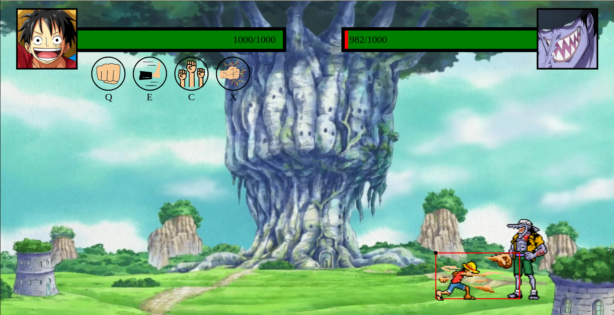

Javascript Web Game Project. Characters and backgrounds are inspired by the One Piece series.
The project is built upon the HTML's canvas element.

This JS project is a 2D game where you are supposed to engage a duel with an enemy using a moveset.
The player's character can move around and jump. It is also provided of a moveset composed of 4 different animation which cooldown is shown by some icons under the healthbar. The HUD (Heads-Up Display) is also formed by the icons of both of the characters.

With every page refresh, the background change randomly from a collection of seven distinct backgrounds. 

However at the current state of things the game is not provided of algorithm that allows the enemy to fulfill any action. Therefore the player's character is the only one fully animated.

Following there are some images of the game.

     
    
    
<i>The game starting screen</i>

     
    
    
<i>The player's character during an attack animation</i>

